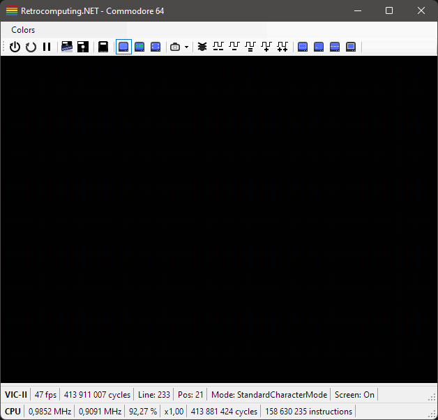
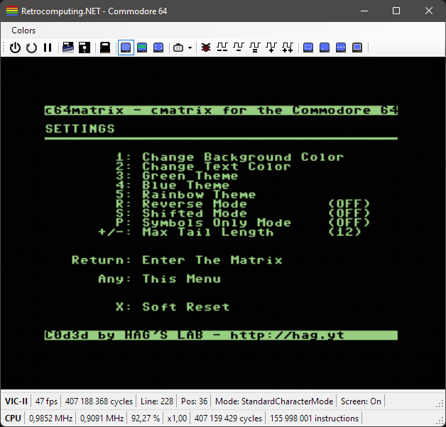
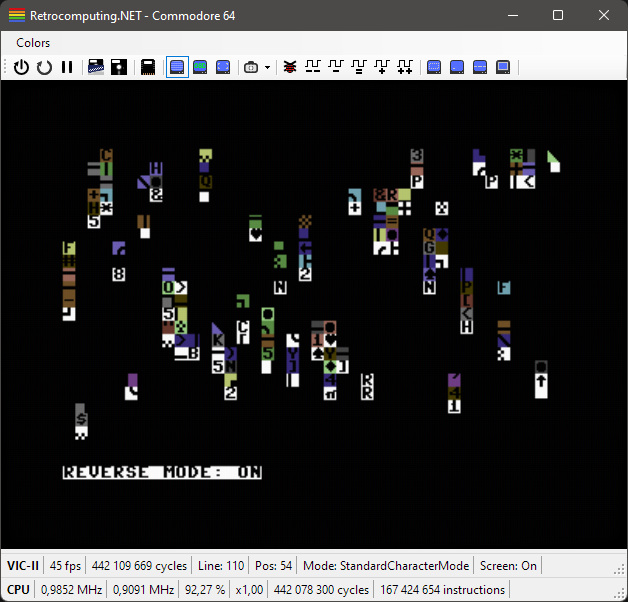
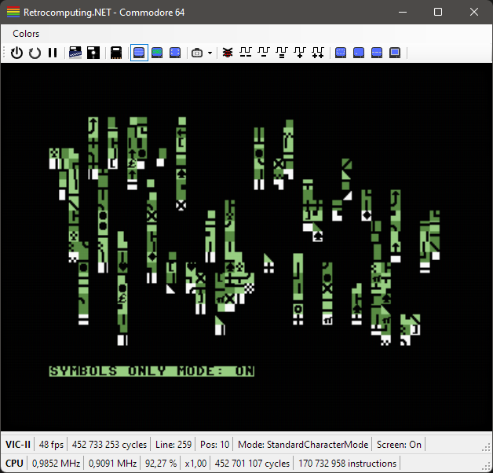

# c64matrix

## Description

`c64matrix` is a version of the classic [`cmatrix`](https://www.asty.org/cmatrix/) program, but for the Commodore 64. `c64matrix` is written in C and uses the CC65 cross compiler.

## Features

- Customizable Background & Foreground Colors
- Green & Blue Theme Presets
- Rainbow Theme
- Reversed Characters Mode
- Shifted Character Set Mode
- Symbols Only Mode (PETSCII Symbols)
- Adjustable "Tail" Length

## Preview

*GIF preview of the three themes; green, blue and rainbow.*

## Releases

A cartridge image (`.bin`) as well as a `.prg`-file is available in the release section.

### Raw Cartridge Image (`.bin`)

The raw cartridge image can be burned to an `(E)EPROM` to create a physical cartridge for use with a real Commdore 64. This is ***NOT*** a `.crt` cartridge file.

### Program File (`.prg`)

The `.prg`-file can be used with emulators such as `VICE` and also cartridges like the `Kung Fu Flash`.

## Build From Source

- Install the CC65 cross compiler:
  - `sudo apt install cc65`
- Run make:
  - `make`
- Clean build folder:
  - `make clean`

All build artifacts can be found in the `build` folder.

## Screenshots

*The settings menu with the default colors.*

*The rainbow theme with the reverse mode on.*

*The green theme with symbols only mode on.*

